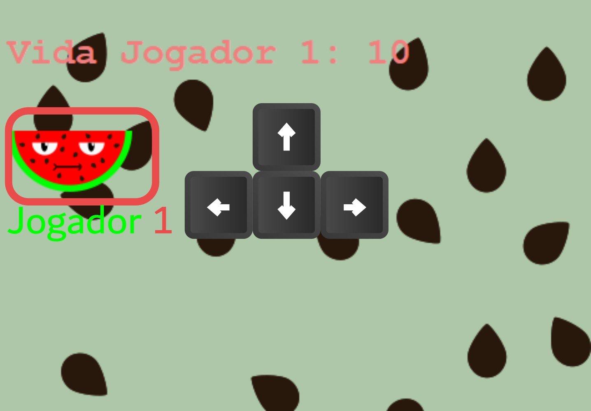
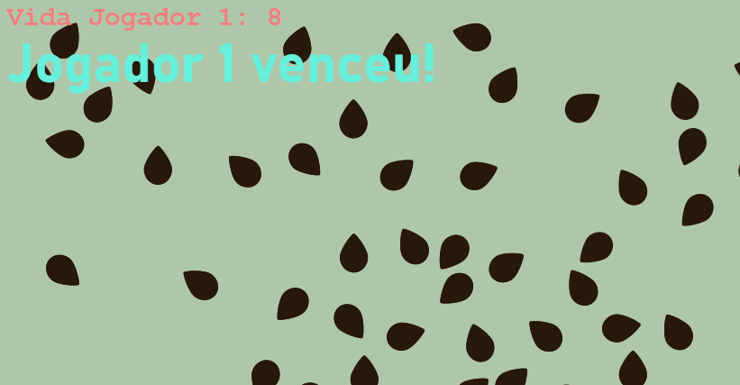
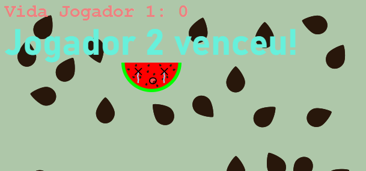

# A Fuga do Watermelon

Watermelon é uma pedaço de Melancia onde nesse jogo, tenta não ser pego pelo mouse. Este é um jogo para dois jogadores, um com o mouse e o outro com as setas do teclado.

Watermelon (ou Jogador 1) tem 10 pontos de vida. A cada clique dado pelo 2º Jogador no 1º, um ponto de vida é removido. Para o Watermelon fugir ele precisa andar para a direita, cima ou baixo, podendo sair dos limites da página. Caso ultrapasse estes limites, ele vence. Caso o Jogador 2 mate o Jogador 1, logo, o Jogador 2 vencerá.

 

Este foi um projeto simples feito em sala de aula com o objetivo de trabalhar com HTML e CSS e utilizar os eventos.

Este jogo foi entregue no dia 21/06/2022.

Música de fundo: *Banana Song* made by *106*.

*Notas Pessoais*: Este é um dos códigos de que mais tenho orgulho. Devido à organização. Fiz ele ainda no começo, logo muitas coisas foram feitas na base da gambiarra, mas ainda sim, se mantém um código limpo e compreensível. Espero em algum momento passe esse jogo de uma forma mais "jogável" ao phaser. Aguardem 😁

**LEMBRANDO QUE O JOGO (O QUE INCLUI CÓDIGO E DESIGN) SÃO DE MINHA AUTORIA E NÃO DEVEM SER USADOS SEM A MINHA PERMISSÃO.**
